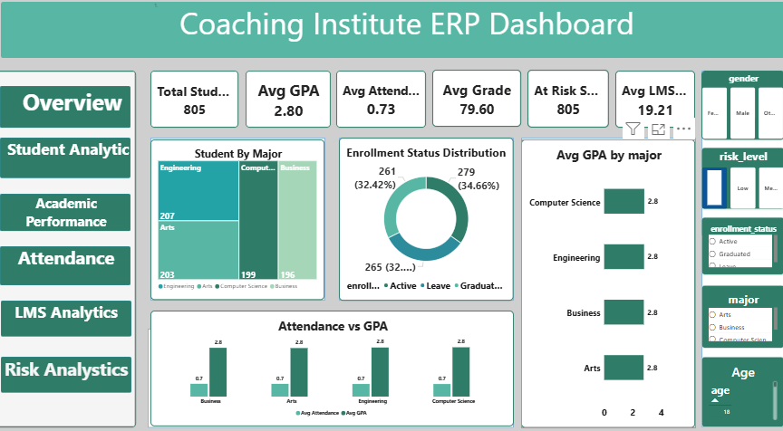

# Coaching Institute ERP Dashboard

## Dashboard Preview

## Project Overview

The Coaching Institute ERP Dashboard is an interactive Power BI solution developed to monitor student performance, attendance, enrollment status, learning engagement, and academic outcomes. The dashboard provides a centralized view of key educational metrics, helping administrators and faculty make informed decisions to improve student success and institutional performance.

## Key Performance Indicators (KPIs)

- Total Students: 805
- Average GPA: 2.80
- Average Attendance Rate: 73%
- Average Grade: 79.60
- At-Risk Students: 805
- Average LMS Activity: 19.21

## Key Insights

- Engineering has the highest student enrollment among all majors.
- Most students are currently in active enrollment status.
- Average GPA remains consistent across different majors.
- Attendance and GPA show a positive relationship, indicating better academic performance among regularly attending students.
- Risk analysis helps identify students requiring additional academic support.
- LMS engagement metrics provide insights into student participation in online learning activities.

## Dashboard Features

- Student Analytics
- Academic Performance Analysis
- Attendance Monitoring
- LMS Analytics
- Risk Analysis
- Enrollment Status Tracking
- Major-wise Student Distribution
- Interactive Slicers and Filters
- Dynamic KPI Cards

## Tools & Technologies

- Power BI Desktop
- Power Query
- DAX (Data Analysis Expressions)
- Microsoft Excel

## Skills Demonstrated

- Data Cleaning
- Data Transformation
- Data Modeling
- DAX Measures
- Data Visualization
- Educational Data Analytics
- Business Intelligence
- Dashboard Development

## Business Impact

This dashboard enables educational institutions to monitor student performance, track attendance trends, analyze enrollment patterns, identify at-risk students, and improve decision-making through data-driven insights. It helps enhance academic planning, student retention, and overall institutional effectiveness.

## Author

**Bhawana**

Aspiring Data Analyst | Power BI Developer | SQL | Excel | Data Visualization

# Coaching-Institute-ERP-Dashboard -https://github.com/bulbulmishra591995-rgb/Coaching-Institute-ERP-Dashboard
